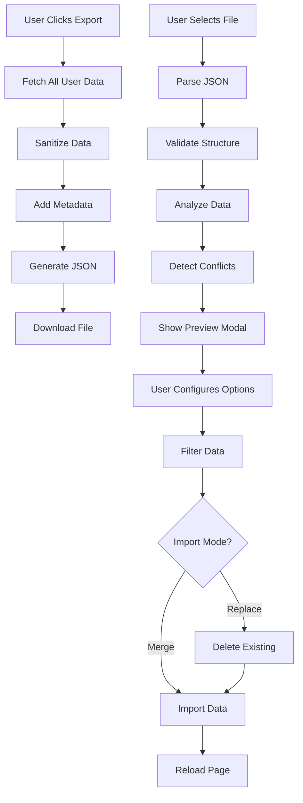

# Export/Import Feature Guide

## Overview

The enhanced Export/Import feature allows users to backup, restore, and migrate their todo data with comprehensive validation, conflict detection, and flexible import options.

## Features Implemented

### ✅ 1. Enhanced Export with Metadata

**Location:** [`src/components/common/ExportImport.tsx`](../src/components/common/ExportImport.tsx)

**What's New:**

- Export includes metadata about who exported the data and when
- Statistics summary (total lists, todos, subtasks, tags)
- Sanitized data (removes `user_id` fields for privacy)
- Properly formatted JSON with version control

**Export Format:**

```json
{
  "version": 1,
  "exportedAt": "2026-04-05T08:00:00.000Z",
  "exportedBy": {
    "userId": "uuid-here",
    "email": "user@example.com"
  },
  "stats": {
    "totalLists": 6,
    "totalTodos": 10,
    "totalSubtasks": 5,
    "totalTags": 3
  },
  "lists": [...],
  "todos": [...],
  "subtasks": [...],
  "tags": [...],
  "todoTags": [...]
}
```

### ✅ 2. Comprehensive Import Validation

**Location:** [`src/lib/utils/export-validation.ts`](../src/lib/utils/export-validation.ts)

**Validation Checks:**

- ✓ Valid JSON structure
- ✓ Version compatibility
- ✓ Required fields present
- ✓ Data type validation
- ✓ Array structure validation

**Error Messages:**

- Clear, actionable error messages
- Version mismatch warnings
- Missing field notifications

### ✅ 3. Import Preview & Analysis

**Features:**

- **Summary Statistics:** Shows counts of lists, todos, subtasks, and tags
- **Todo Breakdown:** Displays pending, in-progress, completed, and cancelled counts
- **Warnings:** Alerts for overdue tasks, archived lists, and cross-user imports

**Preview Information:**

```
Import Summary:
- Lists: 6
- Todos: 10
- Subtasks: 5
- Tags: 3

Todo Status Breakdown:
- Pending: 4
- In Progress: 2
- Completed: 3
- Cancelled: 1

Warnings:
⚠️ Contains 2 overdue tasks
⚠️ This data was exported by another user
```

### ✅ 4. Conflict Detection

**Location:** [`src/lib/utils/conflict-detection.ts`](../src/lib/utils/conflict-detection.ts)

**Detects:**

- Duplicate list names
- Cross-user imports
- Potential data conflicts

**Behavior:**

- Warns users about duplicates
- Explains that duplicates will be imported as separate lists
- Notifies when importing another user's data

### ✅ 5. Flexible Import Options

**Import Modes:**

1. **Merge Mode** (Default)
   - Adds imported data to existing data
   - Preserves all current data
   - Creates new IDs for imported items
   - Safe for regular backups

2. **Replace Mode**
   - Deletes ALL existing data first
   - Then imports the new data
   - Use for complete data restoration
   - ⚠️ Destructive operation

**Filters:**

- **Include Completed Todos:** Toggle to skip completed tasks
- **Include Archived Lists:** Toggle to skip archived lists

### ✅ 6. Data Sanitization

**Export Sanitization:**

- Removes `user_id` fields (privacy)
- Keeps only necessary data
- Reduces file size

**Import Sanitization:**

- Filters data based on user preferences
- Removes completed todos if unchecked
- Removes archived lists if unchecked
- Assigns all data to current user

### ✅ 7. Security Features

**Row Level Security (RLS):**

- All queries filtered by authenticated user
- Cannot access other users' data
- Cannot insert data for other users
- Database-level protection

**Import Security:**

- All imported data forcibly assigned to current user
- Original `user_id` values ignored
- New UUIDs generated for all records
- No data leakage possible

## Usage Guide

### Exporting Data

1. Navigate to **Settings** page
2. Scroll to **Data Export & Import** section
3. Click **Export All Data** button
4. File downloads as `todoMasterAI-export-YYYY-MM-DD.json`

**What Gets Exported:**

- All your lists (with colors, icons, positions)
- All your todos (with status, priority, due dates)
- All your subtasks
- All your tags
- All todo-tag associations

### Importing Data

1. Navigate to **Settings** page
2. Click **Import Data** button
3. Select a `.json` export file
4. **Preview Modal Opens** showing:
   - Import summary
   - Todo breakdown
   - Warnings (if any)
5. **Configure Import Options:**
   - Choose import mode (Merge or Replace)
   - Toggle completed todos
   - Toggle archived lists
6. Click **Import** or **Replace & Import**
7. Page reloads with imported data

## Use Cases

### 1. Personal Backup

```
Export → Save file → Import later if needed
Mode: Merge
Include: All data
```

### 2. Data Migration

```
Export from old account → Import to new account
Mode: Replace (on new account)
Include: All data
```

### 3. Sharing Todo Templates

```
Export → Share file → Others import
Mode: Merge
Include: Skip completed todos
```

### 4. Clean Slate Restore

```
Export backup → Delete some data → Import backup
Mode: Replace
Include: All data
```

### 5. Selective Import

```
Export → Import to another account
Mode: Merge
Include: Only pending todos, no archived lists
```

## Technical Details

### File Structure

**Created Files:**

- [`src/types/export.ts`](../src/types/export.ts) - Type definitions
- [`src/lib/utils/export-validation.ts`](../src/lib/utils/export-validation.ts) - Validation logic
- [`src/lib/utils/conflict-detection.ts`](../src/lib/utils/conflict-detection.ts) - Conflict detection

**Modified Files:**

- [`src/components/common/ExportImport.tsx`](../src/components/common/ExportImport.tsx) - Main component

### Data Flow



### ID Mapping Strategy

When importing, old IDs are mapped to new IDs:

```typescript
Old List ID → New List ID
Old Todo ID → New Todo ID
Old Tag ID → New Tag ID

// Relationships preserved:
Todo.list_id = listIdMap.get(oldListId)
Subtask.todo_id = todoIdMap.get(oldTodoId)
TodoTag.tag_id = tagIdMap.get(oldTagId)
```

## Security Considerations

### ✅ Safe Operations

1. **Export:** Only exports current user's data (RLS enforced)
2. **Import:** All data assigned to current user
3. **Cross-user:** Safe - data gets re-owned
4. **Duplicates:** Safe - new IDs generated

### ⚠️ Important Notes

1. **Replace Mode:** Deletes ALL existing data - use carefully
2. **No Undo:** Import operations cannot be undone (except via backup)
3. **File Sharing:** Export files contain your todo data - share carefully
4. **Version Control:** Only version 1 supported currently

## Future Enhancements

Potential additions:

- [ ] CSV export format
- [ ] Markdown export format
- [ ] iCal/ICS export for calendar integration
- [ ] Scheduled automatic backups
- [ ] Cloud backup integration
- [ ] Import from other todo apps
- [ ] Partial import (select specific lists)
- [ ] Import history/versioning

## Troubleshooting

### Import Fails

**Error: "Invalid export file"**

- Ensure file is valid JSON
- Check file wasn't corrupted
- Verify it's a todoMasterAI export file

**Error: "Unsupported export version"**

- Update your app to latest version
- File may be from newer version

### Duplicate List Names

**Warning shown but import succeeds**

- This is normal behavior
- Duplicates imported as separate lists
- Rename lists after import if needed

### Missing Data After Import

**Check import options:**

- Did you uncheck "Include completed todos"?
- Did you uncheck "Include archived lists"?
- Use "Merge" mode to keep existing data

## API Reference

### Types

```typescript
interface ExportData {
  version: number;
  exportedAt: string;
  exportedBy?: ExportMetadata;
  stats?: ExportStats;
  lists: Record<string, unknown>[];
  todos: Record<string, unknown>[];
  subtasks: Record<string, unknown>[];
  tags: Record<string, unknown>[];
  todoTags: Record<string, unknown>[];
}

enum ImportMode {
  MERGE = "merge",
  REPLACE = "replace",
}

interface ImportOptions {
  mode: ImportMode;
  includeCompleted: boolean;
  includeArchived: boolean;
}
```

### Functions

```typescript
// Validation
validateImportData(data: unknown): ExportData
analyzeImportData(data: ExportData): ImportAnalysis
sanitizeForExport<T>(data: T[]): Omit<T, 'user_id'>[]
filterImportData(data: ExportData, options): ExportData

// Conflict Detection
detectConflicts(importData: ExportData, userId: string): Promise<ConflictDetection>
isDifferentUser(importData: ExportData, currentUserId: string): boolean
getImportSummary(data: ExportData): string
```

## Changelog

### Version 1.0.0 (2026-04-05)

**Added:**

- ✅ Enhanced export with metadata and statistics
- ✅ Comprehensive import validation
- ✅ Import preview modal with analysis
- ✅ Conflict detection for duplicate names
- ✅ Flexible import modes (Merge/Replace)
- ✅ Import filters (completed/archived)
- ✅ Data sanitization for privacy
- ✅ Cross-user import support
- ✅ Detailed warnings and error messages
- ✅ Build verification passed

**Security:**

- ✅ RLS policies enforced
- ✅ User-scoped operations
- ✅ No data leakage possible
- ✅ Safe cross-user imports

---

**Documentation Last Updated:** 2026-04-05
**Feature Status:** ✅ Production Ready
